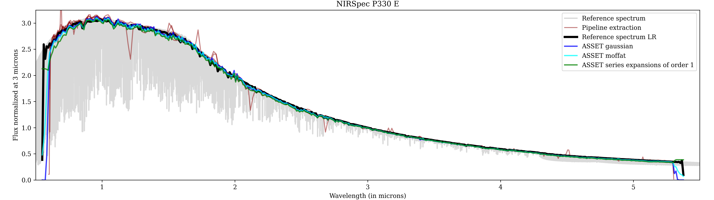
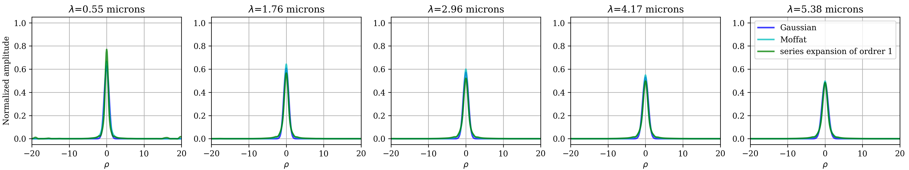
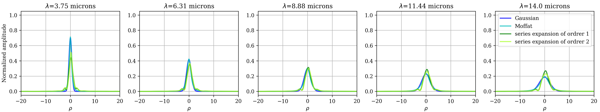

# Summary

Based on the maximum a posteriori likelihood criterion, [`ASSET`](https://github.com/SlitSpectroscopyBuddies/ASSET) is a Julia package providing an optimized, robust spectral extraction method that can be used across various slit spectrographs, ensuring high-quality data extraction
independent of the specific instrument. Thanks to its generic structures, different PSF and background models can be
easily defined by the user to adapt the estimation process to the instrument. Fitting of the background, of the instrument's PSF and refinement of the spatio-spectral calibration of the detector are already possible if wanted.

# Statement of need

Spectroscopy serves as a powerful tool for characterizing the chemical components of celestial bodies, including stars, planets and smaller objects in our solar system. Slit spectroscopy is a common approach particularly valuable
for faint object observations that may otherwise be challenging with integral
field spectroscopy. Many instruments have been developed in that regard. For
example, the SPHERE-IRDIS instrument [@Beuzit:2019], with its near-infrared long-slit
spectroscopy mode [@Dohlen:2008] covering J, H, and K bands (1 to 2.5 microns) with a
resolution R=350, allows for detection and characterization of high contrast
Dwarfs companions [@Hinkley:2015; @Cheetham:2018; @Mesa:2020] at small angular separation (0.5''). The James Web
Space Telescope (JWST) contains two instruments equipped with slit mode : the
NIRSpec (near-infrared) [@Jakobsen:2022; @Boker:2023], covering a wide range of 0.6 to 5.3 microns with low
and high resolution, allowing for the characterization of faint solar system
small bodies [@Denneulin:2023; @Thomas:2025; @GuilbertLepoutre:2025]  and faint stars or
galaxies,  and MIRI (mid-infrared) [@Wright:2023; @Kendrew:2015], covering a wavelength range of 5 to 14
microns, allows for the characterization of solar system objects
[@Muller:2023] or, combined with a coronograph, the detection and
characterization of exoplanets [@Danielski:2018; @Henning:2024]. The future ELT instrument METIS should be
equipped with a long-slit as well, allowing for the observation potential
earth-like planet at very low separation [@Maire:2021].

To exploit the full potential of slit spectroscopy data, it is essential to develop advanced spectral extraction methods. Precise calibration of the spatio-spectral coordinates on the detector is crucial to map the spatial and spectral dimensions accurately. Additionally, accounting for the instrument's point spread function (PSF) is necessary to ensure reliable extraction of spectral feature. In many cases, robust background subtraction is also essential to eliminate unwanted contributions from other sources in the field of view, scattered light and detector artifacts such as bad-pixels or cosmic rays.

[`ASSET`](https://github.com/SlitSpectroscopyBuddies/ASSET) offers a flexible and thorough approach to address these challenges. This Julia package aims at
providing a generic estimation framework based on the maximum a posteriori likelihood criterion. Different structures of parametric and non-parametric PSF are already proposed and can be refined via an alternate estimation scheme with
the spectrum. With the same versatility, a custom background model can be
defined, fitted and subtracted in the estimation scheme. Finally, the package
includes several regularization structures via the use of [`InverseProblem`](https://github.com/SJJThe/InverseProblem).

The [`ASSET`](https://github.com/SlitSpectroscopyBuddies/ASSET) package is a full Julia implemented solution to extract spectrum from slit spectroscopy data. It yields an optimal extraction method (in the sense of the maximum of likelihood). It can be applied on any calibrated slit spectroscopy data regardless of the instrument used for the acquisition. 
It is designed to generalize the methods presented in [@The:2023] and
[@Denneulin:2023] and to be fully adaptable to any slit spectroscopy instrument.

# Estimation Framework

Slit spectroscopy acquisitions are two-dimensional data, consisting of one spatial and one spectral dimension. The most classical way to extract spectrum from spectroscopic data is the aperture extraction. In the context of slit data, it consists in integrating the photons, for each wavelength value in the spectral dimension, in a window of a given height. This method is suboptimal as it does not take into account the full width at half maximum (FWHM) of the instruments point spread function (PSF) or the noise statistic. Moreover, it can integrate artifacts (bad pixels, cosmic ray) that can pollute the spectral extraction.

Inverse problems framework is widely used in astrophysics to tackle these
issues, such as @Michalewicz:2023 and @Berdeu:2024.

The method used in the [`ASSET`](https://github.com/SlitSpectroscopyBuddies/ASSET) package was proposed by @The:2023 for the ESO/VLT SPHERE LSS, then adapted in @Denneulin:2023 for the JWST/NIRSpec FS. It requires the knowledge of the following maps as inputs: 

- the L data maps $(d_\ell)_{\ell \in {1:L}}$
- the L weights maps $w_\ell$, which each element can be computed as the inverse variance of the pixel, forming the matrix $W_{\ell}= \Sigma_{\ell}^{-2}$. We assume that a defective pixel or artifacts have an infinite variance, i.e. a zero entry in $W_{\ell}$.
- the L spatial distribution maps $X_\ell$ where $0$ should correspond to the center of the studied object. #TODO: implement it, it should not be too long even if it seems a big deal
- the L spectral distribution maps $\Lambda_\ell$.

Such maps must be stored in a `CalibratedData` structure using the constructor `CalibratedData(d, w, ρ_map, λ_map)`.

The outputs of the `extract_spectrum!` method are the extracted spectrum $z$, sampled over a given regular wavelength grid $(\lambda_n)_{n \in 1:N}$, and the parameters $\theta$ of the fitted PSF model, stored in a its corresponding structure. The spatial distribution maps $X$, stored in the  `CalibratedData` structure,  and the background map $b$, stored in a `BkgMdl` structure, are auto-calibrated in place.  

`ASSET` uses an inverse problem approach to extract the spectra by fitting a chromatic PSF model on the data.  
$$
z,\theta \in \mathrm{arg min} \Big\{\sum_\ell\Vert d_\ell - (m_\ell(z,\theta) + b)\Vert_{W_{\ell}}^2 + \mu_z\mathcal{R}_z(z) + \mu_\theta\mathcal{R}_\theta(\theta) + \mu_b\mathcal{R}_b(b), \Big\}
$$
where $\mathcal{R}_z$, $\mathcal{R}_\theta$ and $\mathcal{R}_b$ are respectively the regularization of the extracted spectra, of the PSF parameters if required and of the background, with hyperparameters $\mu_z$, $\mu_\theta$ and $\mu_b$. 
$$
m_\ell(z,\theta) = \alpha_\ell Z(\Lambda_\ell,z) \odot H(\theta, X_\ell, \Lambda_\ell)
$$
is the model of the data. It is the Hadamard (element-wise) product of the spectrum interpolated in the camera plane
$$
Z(\Lambda,z)_{j,k}=\sum_n\phi\Big(\frac{\Lambda_{j,k}-\lambda_n}{\delta_\lambda}\Big)z_n
$$

with $\phi$ an interpolation kernel, and of the chromatic PSF $H$. This PSF can have different degrees of freedom depending of the chosen model. In `ASSET` framework, we distinguish  `ParametricPSF` , with low degree of freedom, and `NonParametricPSF` , with hight degree of freedom.  A `ParametricPSF`  $H$ is a function parametrized by a few unknown variables $\theta_n$, *e.g.* a Gaussian chromatic with a minimum width model:
$$
H(\theta, X_\ell, \Lambda_\ell)_{j,k} = \big(2 \pi(\theta_1 \Lambda_{j,k\ell}^2 + \theta_2)\big)^{-1}\exp\Big(-\frac{X_{j,k,\ell}^2}{2(\theta_1\Lambda_{j,k,\ell}^2+\theta_2)}\Big).
$$

It does not require any regularization. See  @The:2023 and @Denneulin:2023 for more details. 

A `NonParametricPSF` is parametrized directly by some profile $(\theta_m)_{m \in  1:M}$,  *e.g.* taking $o$ order of the speckles expansion model [@Devaney:2017] which is the interpolation of the profiles $\theta_o$ in a reference plane of the spatial coordinates $(x_m)_{m \in 1:M}$,:
$$
H(\theta, X_\ell, \Lambda_\ell)_{j,k} = \sum_o \gamma(\Lambda_\ell)^o \sum_m \phi\Big(\frac{\gamma(\Lambda_\ell)X_\ell - x_m}{\delta x}\Big)\theta_{m,o}(x_m).
$$

For such a PSF, $\theta$ must be regularized. The regularization type and the initial hyperparameter must be given in the `NonParametricPSF` structure. The hyperparameter is  auto-calibrated in the method, see @The:2023 for and references therein for more details.

The package provide several `ParametricPSF` and `NonParametricPSF` and the users can easily implement their own. 

# Usage Examples

In these example, [`ASSET`](https://github.com/SlitSpectroscopyBuddies/ASSET) is applied to the target GSPC P 330 E (Program ID 1538) observed with the JWST NIRSpec and MIRI instruments. Being a G dwarfs reference star, the reference spectrum is available [@Bohlin:2014] and is used to demonstrate the capacities of the package to provide a good extraction. For each example, the reference spectrum is resampled to the resolution of the extracted spectra.

## JWST/NIRSpec Fixed Slit

These data were observed the 08/30/2022 with the S1600A1 Fixed Slit with the PRISM grating and CLEAR filter.  It is composed of 5 dithers.

NIRSpec Fixed Slit data have the particularity that under 3.25$\mu$m the Full Width at Half Maximum (FWHM) of the PSF is smaller than the pixel width, thus chromatic PSF is "blured" by the pixel. Thus a chromatic PSF with a minimum width (corresponding to the `chromwmwPSF` particule) should be use. The \autoref{fig:NIRSpecSpectra} and \autoref{fig:NIRSpecPSFs} present the extracted spectrum and fitted PSF models for a gaussian PSF `chromwmwGaussianPSF`, a Moffat PSF `chromwmwMoffatPSF` and one order of the speckle expansion PSF `SeriesExpansionPSF`. The profile fitted by the `SeriesExpansionPSF` is more precise, however the slope of the spectra is affected by the fact that these PSF model does not account for the PSF blur, which is an ongoing work. The parametric PSF account for this blur and allow for a good extraction of the spectrum. [`ASSET` ](https://github.com/SlitSpectroscopyBuddies/ASSET) spectral extraction is also more robust to outliers compared to the JWST pipeline extactions.

## JWST/MIRI Long Slit

These data were observed the 08/14/2022 with the MIRI LRS Slit and the P750L filter. It is composed of 2 dithers. For the bandwidth covered with the MIRI LRS Slit, the target is very faint hence a very bright background for the largest wavelength is present due to a longer integration time.

The \autoref{fig:MIRISpectra} and \autoref{fig:MIRIPSFs} present the extracted spectrum and fitted PSF models for a gaussian PSF `chromGaussianPSF`, a Moffat PSF `chromMoffatPSF`, and one and two orders of the speckle expansion PSF `SeriesExpansionPSF`. The profile fitted by the `SeriesExpansionPSF` is more precise, and the slop fits more accurately the reference spectrum around 5 $\mu$m. [`ASSET` ](https://github.com/SlitSpectroscopyBuddies/ASSET) is more robust to the background brightness than the pipeline method, but it remains perfectible.

# Research projects using the package 

The [`ASSET`](https://github.com/SlitSpectroscopyBuddies/ASSET) package can be used for many slit spectrograph, such as the SPHERE/IRDIS-LSS [@The:2023] used to characterize exoplanets. In this context, speckles are forming a high-contrasted structural background where the extraction of the planet's spectrum is achieved by the method's joint estimation of this background and the instrument's PSF. 

The package is also currently used to extract spectra from JWST/NIRSpec and MIRI data [@Denneulin:2023; @GuilbertLepoutre:2025]. These two instruments involves a diverse set of slits, spectral resolution and positions on the detector, to observe a vast range of targets in terms of flux. The flexible and multi-frame approach of [`ASSET`](https://github.com/SlitSpectroscopyBuddies/ASSET) is particularly interesting as it provides a single methodology to all these problems. 

A particular interest in ongoing work is to correctly extract the spectrum of interest from the strong, but smooth, background present in some MIRI data. NIRSpec data also present some challenges at lower wavelength, where the instrumental PSF is blurred by the pixel integration. Finally, we aim to generalized such an approach to Integral Field Units data.

# Dependencies

[`PointSpreadFunctions`](https://github.com/emmt/PointSpreadFunctions.jl.git), [`InverseProblems`](https://github.com/SJJThe/InverseProblem.git), [`InterpolationKernels`](https://github.com/emmt/InterpolationKernels.jl.git), [`LazyAlgebra`](https://github.com/emmt/LazyAlgebra.jl.git), [`LinearInterpolators`](https://github.com/emmt/LinearInterpolators.jl.git), [`OptimPackNextGen`](https://github.com/emmt/OptimPackNextGen.jl.git), [`PowellMethods`](https://github.com/emmt/PowellMethods.jl.git), [`AMORS`](https://github.com/emmt/AMORS.jl.git) and [`SparseArrays`](https://github.com/JuliaSparse/SparseArrays.jl.git).

# Acknowledgments

James Webb Space Telescope. The data were obtained from the Mikulski Archive for Space Telescopes at the Space Telescope Science Institute, which is operated by the Association of Universities for Research in Astronomy, Inc., under NASA contract NAS5-03127 for JWST. These observations are associated with the calibration program #1538.

The authors would like to explicitly thank Bryan Holler (STSCI) for his unconditional help, for running the pipeline countless time in order to provide the calibrated data and to answering any minor question.

# References
