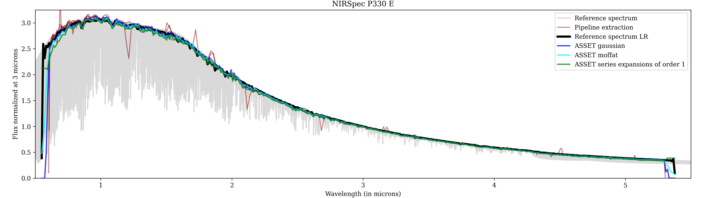
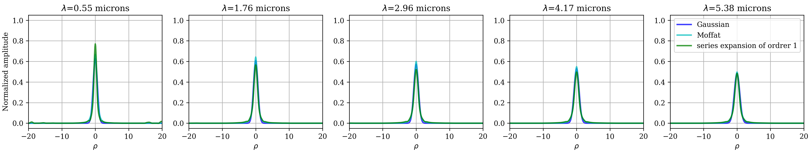
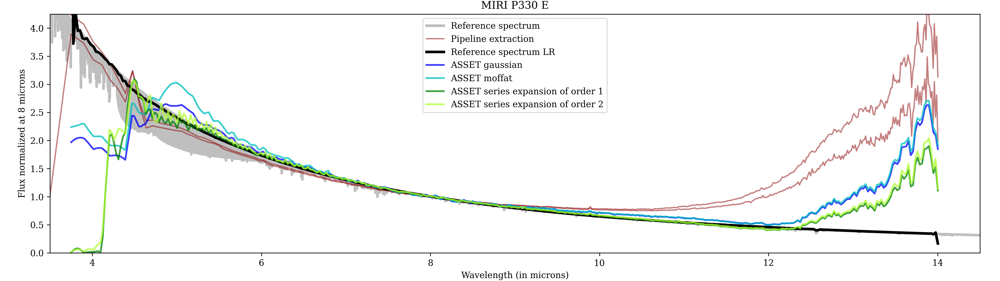
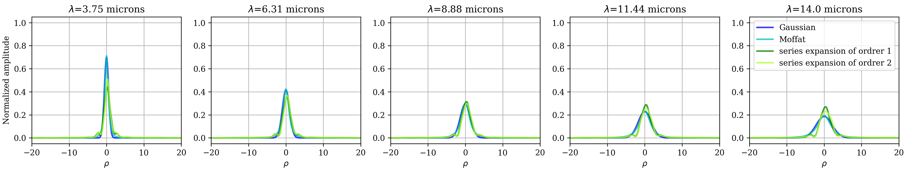

# Summary

Based on the maximum a posteriori likelihood criterion, [`ASSET`](https://github.com/SlitSpectroscopyBuddies/ASSET) is a Julia package providing an optimized, robust spectral extraction method that can be used across various slit spectrographs, ensuring high-quality data extraction
independent of the specific instrument. Thanks to its generic structures, different PSF and background models can be
easily defined by the user to adapt the estimation process to the instrument. Fitting of the background, of the instrument's PSF and refinement of the spatio-spectral calibration of the detector are already possible if wanted.

# Statement of need

Spectroscopy is a powerful tool for characterizing the chemical components of celestial bodies, including stars, planets and smaller objects in our solar system. Slit spectroscopy is particularly valuable
for faint object observations that may otherwise be challenging with integral
field spectroscopy. Many instruments have been developed in that regard. For
example, the SPHERE-IRDIS instrument [@Beuzit:2019], with its near-infrared long-slit
spectroscopy mode [@Dohlen:2008], allows for detection and characterization of high contrast
Dwarfs companions [@Hinkley:2015; @Cheetham:2018; @Mesa:2020] at small angular separation (0.5''). The James Web Space Telescope (JWST) contains two instruments equipped with slit mode: the
NIRSpec (near-infrared) [@Jakobsen:2022; @Boker:2023],  allowing for the characterization of faint solar system
small bodies [@Denneulin:2023; @Thomas:2025; @GuilbertLepoutre:2025]  and faint stars or
galaxies,  and MIRI (mid-infrared) [@Wright:2023; @Kendrew:2015], allowing for the characterization of solar system objects [@Muller:2023] or, combined with a coronograph, the detection and
characterization of exoplanets [@Danielski:2018; @Henning:2024]. The future ELT instrument METIS should be
equipped with a long-slit as well, allowing for the observation potential earth-like planet at very low separation [@Maire:2021].

To exploit the full potential of slit spectroscopy data, it is important to account for any element involved in their acquisition process, such as: 

- the shape of the chromatic point spread function (PSF) profile,
- a thorough calibration of the spatial and spectral coordinates of each pixel in order to map correctly the PSF,
- an accurate estimation of the noise statistics and of the artifacts (bad pixels, cosmic rays,...). 

The Inverse problems framework is widely used in astrophysics [@Michalewicz:2023; @Berdeu:2024] and offer the possibility to account for all this elements. Based on such an approach, an optimal auto-calibrated spectral extraction method (in the sense of the maximum of likelihood) was developed in [@The:2023] and adapted in [@Denneulin:2023]. 

The goal of  [`ASSET`](https://github.com/SlitSpectroscopyBuddies/ASSET) is to
generalize this method in an easy to use package, fully implemented in Julia,
adaptable to any slit spectroscopy instrument. It relies on a thorough modeling
of the data using different customizable structures of parametric or
non-parametric PSF, which can be fitted via an alternated algorithm during the
spectrum extraction. With the same versatility, a custom background model can
also be defined, fitted and subtracted in the estimation scheme. Finally, the package
includes several regularization structures via the use of
[`InverseProblem`](https://github.com/SJJThe/InverseProblem).  

# Software design

The method used in the [`ASSET`](https://github.com/SlitSpectroscopyBuddies/ASSET) package requires the following maps as inputs: 

- data maps $(d_\ell)_{\ell \in {1:L}}$, where $L$ is the amount of dithers/acquisitions/frames;
- weights maps $w_\ell$, where each element can be computed as the inverse variance of the pixel, forming the matrix $W_{\ell}= \Sigma_{\ell}^{-2}$. We assume that a defective pixel or artifacts have an infinite variance, i.e. a zero entry in $W_{\ell}$;
- spatial coordinate maps $X_\ell$ where $0$ should correspond to the center of the studied object;
- spectral coordinate maps $\Lambda_\ell$.

The method outputs are the extracted spectrum $z$, sampled over a given regular wavelength grid $(\lambda_n)_{n \in 1:N}$, and the parameters $\theta$ of the fitted PSF model. The spatial distribution maps $X$ and the background map $b$ are auto-calibrated in the process.  The package provide several PSF models and the users can easily implement their own. We decided to dissociate two type of PSF depending of the amount of parameters, because it requires different optimization methods. The `ParametricPSF`  are functions parametrized by a few unknown variables $\theta_m$, *e.g.* a Gaussian function.  The `NonParametricPSF` is parametrized directly by some profile $(\theta_m)_{m \in  1:M}$, thus with high degrees of freedom , *e.g.* taking $o$ order of the speckles expansion model [@Devaney:2017] which is the interpolation of the profiles $\theta_o$ in a reference plane of the spatial coordinates $(x_m)_{m \in 1:M}$. For such a PSF, $\theta$ must be regularized. The hyperparameter is auto-calibrated in the method (see @The:2023 and @Denneulin:2023 for and references therein for more details).

# State of field

Several spectral extraction pipelines exists but they are often dedicated to a specific instrument (vrai ça ? refs).  Moreover, the pipeline methods can be quite basic, leaving the development of more sophisticated methods to the user. For example, the JWST's pipeline proceed to the spectral extraction by summing the pixels for each wavelength after some pre-processing of the data. This methods allows to have an idea to the overall spectrum but is not suitable for the small and faint features. 

Here, we compare [`ASSET`](https://github.com/SlitSpectroscopyBuddies/ASSET) extracted spectra to the JWST pipeline extractions and to the reference spectrum [@Bohlin:2014], resampled to the same resolution, of the G dwarfs reference star GSPC P 330 E, observed with JWST instruments (Program ID 1538). NIRSpec's data were observed the 08/30/2022 with the S1600A1 Fixed Slit, PRISM grating, CLEAR filter, and a 5 dithers pattern. MIRI's data were observed the 08/14/2022 with the MIRI LRS Slit, P750L filter, and a 2 dithers pattern. We also present the fitted chromatic PSF models for different wavelength. 

We used Gaussian and Moffat PSF models (of type `ParametricPSF`) and the series expensions PSF are (of type `NonParametricPSF`.) For NIRSpec (\autoref{fig:NIRSpecSpectra} and \autoref{fig:NIRSpecPSFs}), `ASSET` results are more robust to the outliers than the pipeline extractions for small wavelength. For MIRI LRS (\autoref{fig:MIRISpectra} and \autoref{fig:MIRIPSFs}), the slope of `ASSET` spectra is more accurate above 5 $\mu$m. It is also more robust to the background brightness than the pipeline method, but it remains perfectible, especially under 5 $\mu$m. The PSF profile fitted by the  `NonParametricPSF`  is also more precise.

# Research impact statement

The [`ASSET`](https://github.com/SlitSpectroscopyBuddies/ASSET) package can be used for many slit spectrograph data, such as the SPHERE/IRDIS-LSS [@The:2023], used to characterize exoplanets. In this context, speckles are forming a high-contrasted structural background where the extraction of the planet's spectrum is achieved by the method's joint estimation of this background and the instrument's PSF. The package is also currently used to extract spectra from JWST/NIRSpec data [@Denneulin:2023; @GuilbertLepoutre:2026, @Cryan:2026]. This instrument involves a diverse set of slits, spectral resolution and positions on the detector, to observe a vast range of targets in terms of flux. The flexible and multi-frame approach of [`ASSET`](https://github.com/SlitSpectroscopyBuddies/ASSET) is particularly interesting as it provides a single methodology to all these problems. 

A particular interest in ongoing work is to correctly extract the spectrum of interest from the strong, but smooth, background present in some MIRI data, the blurred PSF in NIRSpec data and finally, to generalized such an approach to Integral Field Units data.

# AI usage disclosure

No generative AI tools were used in the development of this software, the writing
of this manuscript, or the preparation of supporting materials.

# Acknowledgments

James Webb Space Telescope. The data were obtained from the Mikulski Archive for Space Telescopes at the Space Telescope Science Institute, which is operated by the Association of Universities for Research in Astronomy, Inc., under NASA contract NAS5-03127 for JWST. These observations are associated with the calibration program #1538.

The authors would like to explicitly thank Bryan Holler (STSCI) for his unconditional help, for running the pipeline countless time in order to provide the calibrated data and to answering any minor question.

# References
